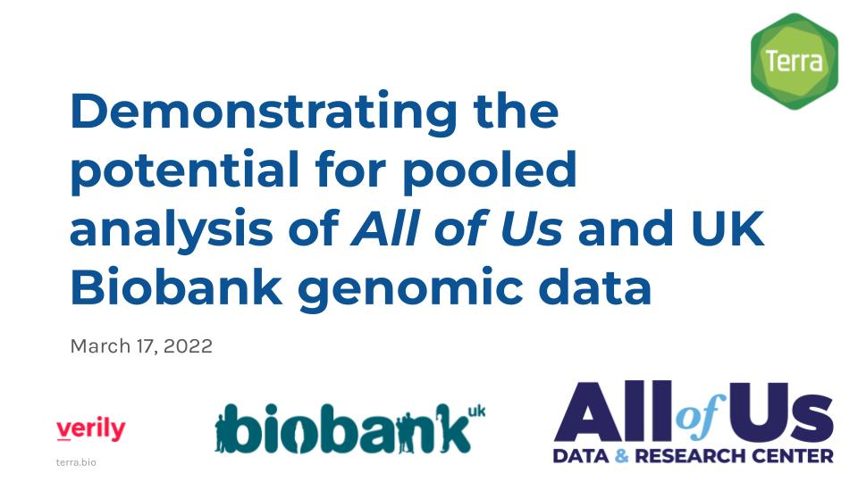
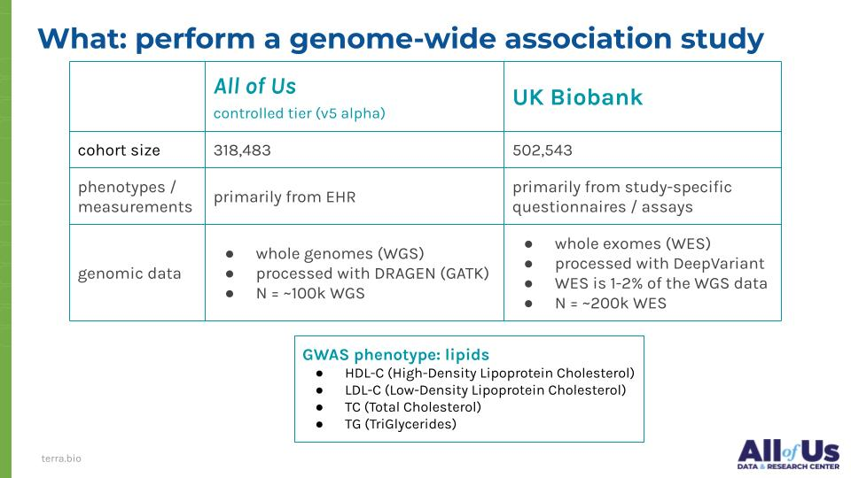
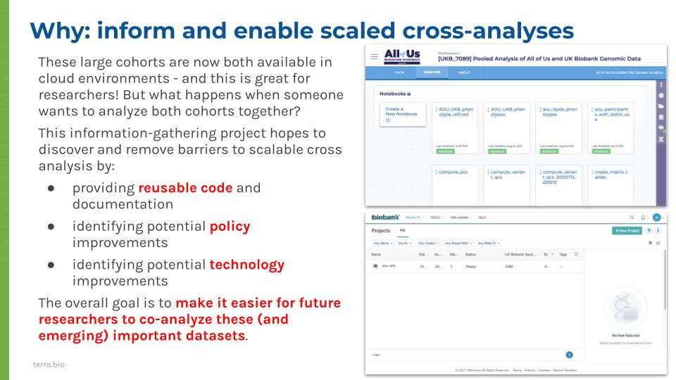
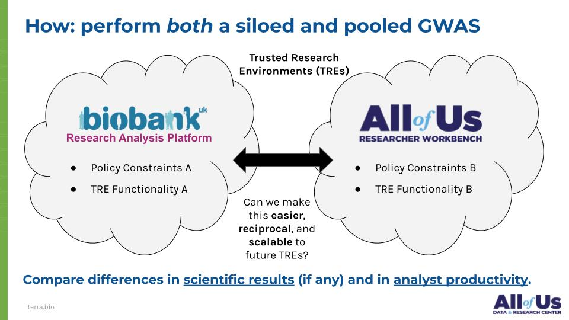
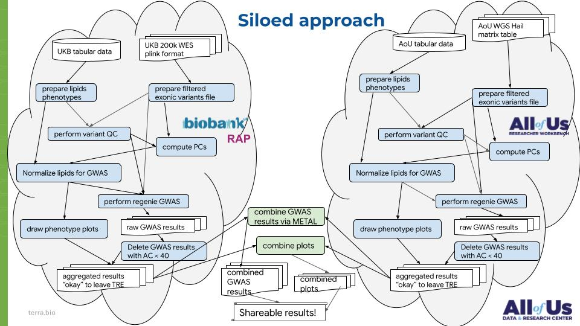
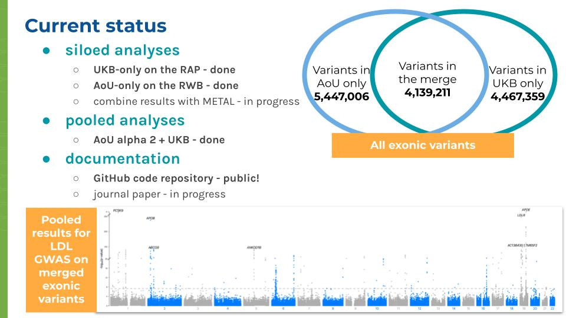

# ukb-cross-analysis-demo-project

The code in this repository performs a genome-wide association study on lipids in three ways:

1. [`ukb_rap_siloed_analysis`](./ukb_rap_siloed_analyses) holds notebooks for the [UK Biobank Research Analysis Platform](https://ukbiobank.dnanexus.com/panx/projects) to perform a GWAS on UK Biobank data.
2. [`aou_workbench_siloed_analysis`](./aou_workbench_siloed_analyses) holds notebooks for the [_All of Us_ Researcher Workbench](https://workbench.researchallofus.org/login) to perform a GWAS on _All of Us_ data.
3. [`aou_workbench_pooled_analyses`](./aou_workbench_pooled_analyses) holds notebooks for the [_All of Us_ Researcher Workbench](https://workbench.researchallofus.org/login) to perform a GWAS on _All of Us_ data pooled together with UK Biobank data.

# Project context

---

---

---

---

---

---

